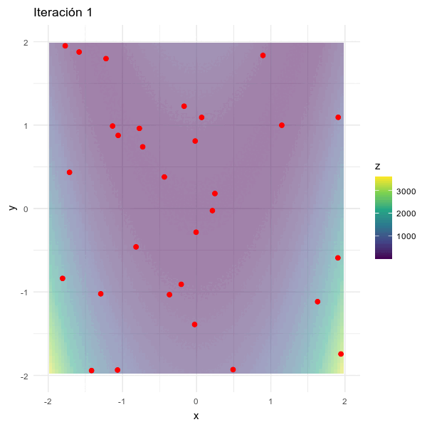
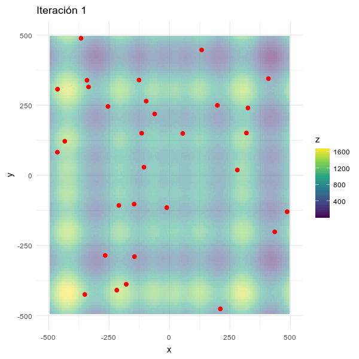
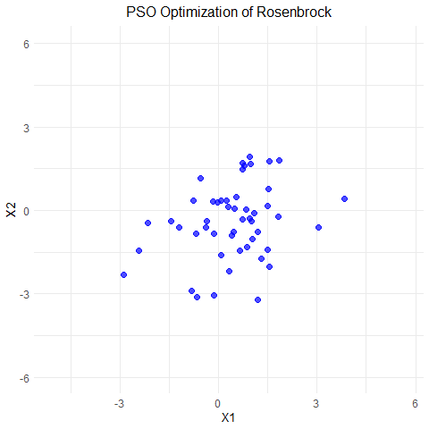
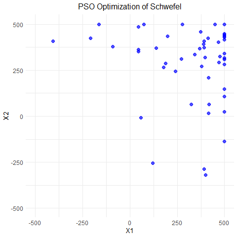
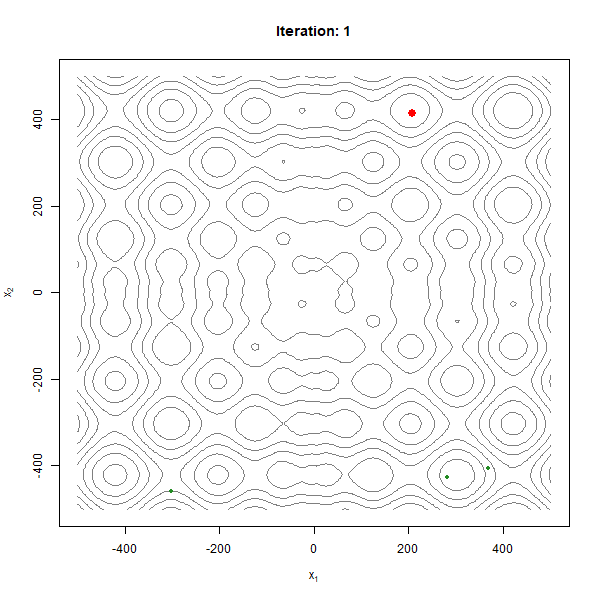
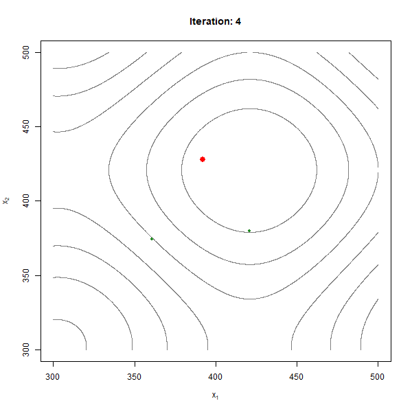
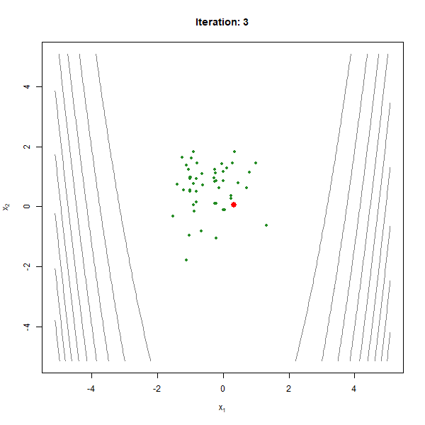

## Importación de Librerias

```{r importacion_librerias, message=FALSE, warning=FALSE}
library(GA)
library(ggplot2)
library(reshape2)
library(plot3D)
library(animation)
library(DEoptim)
library(pso)
library(dplyr)
library(gifski)
library(gganimate)
library(knitr)
library(magick)
```

# OPTIMIZACIÓN NUMÉRICA

Para evaluar el desempeño de distintos métodos de optimización numérica, se seleccionaron dos funciones de prueba ampliamente utilizadas en la literatura: la función de Rosenbrock y la función de Schwefel. Estas funciones presentan características contrastantes que permiten observar cómo los algoritmos se comportan en contextos diferentes: con mínimos globales difíciles de alcanzar o con múltiples mínimos locales que pueden confundir la convergencia.

## Función de Rosenbrock

La función de Rosenbrock es una función unimodal cuyo mínimo global se encuentra en un valle angosto y curvado de forma parabólica. Aunque este valle es fácil de localizar visualmente, alcanzar el mínimo representa un reto para muchos algoritmos debido a la geometría del terreno de optimización.

> "La función es unimodal, y el mínimo global se encuentra en un valle parabólico angosto. Sin embargo, aunque este valle es fácil de encontrar, la convergencia al mínimo es difícil" (Surjanovic & Bingham, s.f.) [traducción propia].

Esto la convierte en un excelente caso para probar algoritmos que deben navegar por terrenos suaves pero estrechos, donde los gradientes pueden apuntar en direcciones poco útiles si no se ajustan bien los parámetros de convergencia.

Para $d$ dimensiones la función de Rosenbrock está dada por la forma:

$$
f(\mathbf{x}) = \sum_{i=1}^{d-1} \left[100(x_{i+1} - x_i^2)^2 + (x_i-1)^2\right]
$$

El siguiente código implementa la función:

```{r definicion_rosenbrock}
funcion_rosenbrock <- function(vector_x){
  
  # Evaluación de la función de Rosenbrock para un vector de entrada vector_x
  
  # Se expresa de esta manera para prevenir el uso de ciclos y 
  # sacar mayor provecho al paradigma de programación funcional
  
  d <- length(vector_x)   # Obtener la dimensión del vector
  xi <- vector_x[1:(d-1)] # x_i
  xnext <- vector_x[2:d]  # x_(i+1)
  
  # f(x) = sum_{i=1}^{d-1} [100 * (x_{i+1} - x_i^2)^2 + (1 - x_i)^2]
  result <- (sum(100*(xnext-xi^2)^2+(xi-1)^2))
  return(result)
}
```


#### Representación 3D de la función:

```{r graficacion_Rosenbrock, echo=FALSE}
x1 <- x2 <- seq(-2, 2, by = 0.05)

# Generación de la matriz de valores de la función
f_rosen <- outer(x1, x2, Vectorize(function(x, y) funcion_rosenbrock(c(x, y))))

# Grafica
persp3D(x1, x2, f_rosen,
        theta = 190, phi = 40,
        col.palette = bl2gr.colors,
        main = "Funcion de Rosenbrock",
        xlab = "x", ylab = "y", zlab = "f(x, y)")
```

## Función de Schwefel

En contraste, la función de Schwefel presenta una superficie altamente compleja, con múltiples mínimos locales dispersos en todo el dominio. Esta característica desafía a los métodos de optimización a evitar caer en soluciones subóptimas y a explorar eficientemente el espacio de búsqueda.

> "La función de Schwefel es compleja, con muchos mínimos locales" (Surjanovic & Bingham, s.f.) [traducción propia].

Este tipo de función es ideal para evaluar algoritmos en escenarios donde la exploración global es tan importante como la exploración local.

Para $d$ dimensiones la función de Schwefel está dada por la forma:

$$
f(\mathbf{x}) = 418.9829 \cdot d - \sum_{i=1}^{d} x_i \sin\left(\sqrt{|x_i|}\right)
$$

El siguiente código implementa la función:

```{r definicion_schwefel}
funcion_schwefel <- function(vector_x){
  
  # Evaluación de la función Schwefel dado un vector de entrada vector_x 
  
  d <- length(vector_x) # Obtener la dimensión del vector
  
  
  # f(x) = 418.9829 * d - sum(x_i * sin(sqrt(|x_i|)))
  # Este valor tiene su mínimo global en x_i ≈ 420.9687 para todo i
  
  sum <- sum(vector_x*sin(sqrt(abs(vector_x))))
  result <- 418.9829*d - sum
  
  return(result)
}
```


#### Representación 3D de la función:

```{r graficacion_schwefel, echo = FALSE}
x1 <- x2 <- seq(-500, 500, by = 10)

# Generación de la matriz de valores de la función
f_schwefel <- outer(x1, x2, Vectorize(function(x, y) funcion_schwefel(c(x, y))))

# Grafica
persp3D(x1, x2, f_schwefel,
        theta = 50, phi = 40,
        col.palette = bl2gr.colors,
        main = "Funcion de Schwefel",
        xlab = "x", ylab = "y", zlab = "f(x, y)")

```

## Optimización por Descenso del Gradiente

Para poder optimizar ambas funciones en dos y tres dimensiones se necesita un optimizador que haga uso del gradiente numérico.

Inicialmente se debe obtener la derivada parcial de la función respecto a alguna de sus componentes.

```{r calculo_derivada_parcial}
partial_dev <- function(x,i,fun,h=0.01){
    e <- x*0 # crea un vector de ceros de la misma longitud de x
    e[i] <- h
    y <- (fun(x+e)-fun(x-e))/(2*h)
  return(y)
}
```

Se evalua el gradiente de la función al obtener cada una de las derivadas parciales de $f$ en $x$

```{r calculo_gradiente_numerico}
num_grad <- function(x,fun,h=0.01){
  # x: punto del espacio donde se debe evaluar el gradiente
  # fun: función para la que se desea calcular el gradiente en x
  # h: es el tamaño de ventana para el cálculo de la derivada numérica
  d <- length(x)
  y <- mapply(FUN=partial_dev,i=1:d,MoreArgs=list(x=x,h=h,fun=fun))
  return(y)
}

```

EL siguiente código hace uso del gradiente númerico para calcular el descenso del gradiente númerico con una tasa de aprendizaje variable:

```{r optimizacion_multivariada}
optimizador_multivariado <- function(fun, x0, eta0=0.1, decay=0.01, max_eval=100, h=0.01, tol = 1e-5) {


  x <- matrix(NA, nrow=max_eval, ncol=length(x0))  # Matriz para registrar los puntos iterativos
  f_values <- numeric(max_eval)       # Vector para registrar los valores de la función objetivo
  
  
  x[1, ] <- x0                # asignar a la primer columna de la matriz x el vector x0
  f_values[1] <- fun(x0)      # valor inicial de la función
  
  
  for (i in 2:max_eval) {
    
    # Calcula el gradiente numérico en la iteración anterior
    grad <- num_grad(x[i-1, ], fun, h)   
    
    # Tasa de aprendizaje variable (disminuye con el tiempo)
    eta <- eta0 / (1 + decay * (i - 1)) 
    
    # Paso de descenso: actualiza x restando el gradiente
    x[i, ] <- x[i-1, ] - eta * grad      
    
    # Calcular valor de la función en el nuevo punto
    f_values[i] <- fun(x[i, ])
    
    # Magnitud del cambio entre iteraciones
    cambio <- sqrt(sum((x[i, ] - x[i-1, ])^2))     
    
    # Si el cambio es muy pequeño, se asume convergencia
    if (cambio < tol) {                
      break
    }
  }
  
  
  result <- list(
    puntos = x[1:i, ],          # Puntos recorridos
    valores = f_values[1:i],    # Valores de la función objetivo
    iteraciones = i,            # Número total de iteraciones
    solucion = x[i, ],          # Solución final encontrada
    valor_optimo = f_values[i]  # Valor óptimo encontrado
  )
  
  return(result)  
}


```

### Condición Inicial Aleatoria

EL siguiente código genera un vector de $n$ dimensiones para ser evaluado en el optimizador multivariado.

```{r condicion_inicial_aleatoria}
vector_aleatorio <- function(n,limInf, limSup, seed = NULL){
  if (!is.null(seed)){
    set.seed(seed) # semilla fija solo si fue proporcionada 
  }
  
  return(runif(n, min = limInf, max = limSup)) # Vector aleatorio en el rango proporcionado
}
```

### Optimización de Función Rosenbrock

#### Dos Dimensiones:

```{r optimizacion_rosenbrock_2_dimensiones}
x0_2d_rosenbrock <- vector_aleatorio(2, -2.048 , 2.048, seed = 28)

res_rosenbrock_2d <- optimizador_multivariado(funcion_rosenbrock, 
                                              x0 = x0_2d_rosenbrock, 
                                              eta0 = 0.001,
                                              decay = 0.2)

cat("Solución: ",res_rosenbrock_2d$solucion, "\nValor optimo: ", res_rosenbrock_2d$valor_optimo)


```

```{r graficacion_del_proceso_rosenbrock_2d}
sol <- res_rosenbrock_2d$puntos

n_length <- 100
x1 <- seq(-2, 2, length.out = n_length)
x2 <- seq(-2, 2, length.out = n_length)
X <- expand.grid(x1, x2)

# Evaluar la función en toda la grilla
z <- apply(X, 1, function(row) funcion_rosenbrock(c(row[1], row[2])))
Z <- matrix(z, ncol = n_length, nrow = n_length)

# Crear gráfico de curvas de nivel
contour(x1, x2, Z,
        xlab = expression(x[1]), ylab = expression(x[2]),
        main = "Ejemplo: Curvas de nivel - Función de Rosenbrock",
        sub = "Camino del optimizador multivariado",
        las = 1, drawlabels = TRUE)

#leyendas
legend(-1.5, 2, legend = c("Punto de inicio", "Pasos"), fill = c("blue", "red"))
#Pasos
lines(sol[,1], sol[,2], type = "b", pch = 19, col = "red", lwd = 2)
#Punto de incio
points(sol[1,1], sol[1,2], col = "blue", pch = 19, cex = 1.8)


```

#### Tres Dimensiones:

```{r optimizacion_rosenbrock_3_dimensiones}
x0_3d_rosenbrock <- vector_aleatorio(3, -2.048 , 2.048, seed = 45)

res_rosenbrock_3d <- optimizador_multivariado(funcion_rosenbrock, 
                                              x0 = x0_3d_rosenbrock, 
                                              eta0 = 0.001,
                                              decay = 0.2)

cat("Solución: ",res_rosenbrock_3d$solucion, "\nValor optimo: ", res_rosenbrock_3d$valor_optimo)
```

### Optimización de Función de Schwefel

#### Dos Dimensiones:

```{r optimizacion_Schwefel_2_dimensiones}
x0_2d_schwefel <- vector_aleatorio(2, -500 , 500, seed = 69)

res_schwefel_2d <- optimizador_multivariado(funcion_schwefel, 
                                              x0 = x0_2d_schwefel, 
                                              eta0 = 0.3,
                                              decay = 0.01)

cat("Vector origen: ", x0_2d_schwefel,"\nSolucion: ",res_schwefel_2d$solucion, "\nValor optimo: ", res_schwefel_2d$valor_optimo)
```

```{r graficacion_del_proceso_schwefel_2d}
sol <- res_schwefel_2d$puntos

n_length <- 100
x1 <- seq(-500, 500, length.out = n_length)
x2 <- seq(-500, 500, length.out = n_length)
X <- expand.grid(x1, x2)

# Evaluar la función en toda la grilla
z <- apply(X, 1, function(row) funcion_schwefel(c(row[1], row[2])))
Z <- matrix(z, ncol = n_length, nrow = n_length)

# Crear gráfico de curvas de nivel
contour(x1, x2, Z,
        xlab = expression(x[1]), ylab = expression(x[2]),
        main = "Curvas de nivel - Funcion de schwefel",
        sub = "Camino del optimizador multivariado",
        las = 1, drawlabels = TRUE)

#leyendas
legend(-400, -200, legend = c("Punto de inicio", "Pasos"), fill = c("blue", "red"))
#Pasos
lines(sol[,1], sol[,2], type = "b", pch = 19, col = "red", lwd = 2)
#Punto de incio
points(sol[1,1], sol[1,2], col = "blue", pch = 19, cex = 1.8)


```

```{r graficacion_del_proceso_schwefel_2d_zoom}
sol <- res_schwefel_2d$puntos

n_length <- 100
x1 <- seq(0, 100, length.out = n_length)
x2 <- seq(180, 300, length.out = n_length)
X <- expand.grid(x1, x2)

# Evaluar la función en toda la grilla
z <- apply(X, 1, function(row) funcion_schwefel(c(row[1], row[2])))
Z <- matrix(z, ncol = n_length, nrow = n_length)

# Crear gráfico de curvas de nivel
contour(x1, x2, Z,
        xlab = expression(x[1]), ylab = expression(x[2]),
        main = "Curvas de nivel con zoom - Funcion de schwefel",
        sub = "Camino del optimizador multivariado",
        las = 1, drawlabels = TRUE)

#leyendas
legend(80, 290, legend = c("Punto de inicio", "Pasos"), fill = c("blue", "red"))
#Pasos
lines(sol[,1], sol[,2], type = "b", pch = 19, col = "red", lwd = 2)
#Punto de incio
points(sol[1,1], sol[1,2], col = "blue", pch = 19, cex = 1.8)


```

#### Tres Dimensiones:

```{r optimizacion_schwefel_3_dimensiones}
x0_3d_schwefel <- vector_aleatorio(3, -2.048 , 2.048, seed = 45)

res_schwefel_3d <- optimizador_multivariado(funcion_schwefel, 
                                              x0 = x0_3d_schwefel, 
                                              eta0 = 0.3,
                                              decay = 0.01)

cat("Solución: ",res_schwefel_3d$solucion, "\nValor optimo: ", res_schwefel_3d$valor_optimo)
```

# Optimización Heurística

Ante las limitaciones del algoritmo de optimización por descenso del gradiente se plantea el uso de otros tres algoritmos que pueden tener un mejor desempeño.Estos son: 

* Algoritmos Evolutivos.
* Optimización de Particulas.
* Evolución Diferencial.

## Algoritmos Evolutivos

Los algoritmos evolutivos son técnicas de optimización inspiradas en los principios de la selección natural y genética. Operan sobre una población de soluciones que evoluciona a través de generaciones mediante operadores como selección, cruzamiento y mutación. Cada individuo representa una solución candidata al problema, y su adecuación se evalúa mediante una función objetivo. A lo largo de las iteraciones, las soluciones de mayor aptitud tienden a prevalecer, promoviendo la exploración y explotación del espacio de búsqueda.

Mediante el uso de la librería `'GA'` se va implementar un algoritmo genético para optimizar ambas funciones objetivo.


Para evaluar el comportamiento del algoritmo post-evaluación se va a definir una función que registra la población de cada generación junto con el mejor individuo de la población.
```{r definicion_funcion_postfit}
make_postfit <- function(pop_store_name, best_store_name = NULL) {
  # Clear previous population variable
  assign(pop_store_name, list(), envir = globalenv())

  # Clear best individual variable if provided
  if (!is.null(best_store_name)) {
    assign(best_store_name, list(), envir = globalenv())
  }

  function(object, ...) {
    pop <- object@population
    fitness <- object@fitness

    # Append current population
    pop_list <- get(pop_store_name, envir = globalenv())
    pop_list <- append(pop_list, list(pop))
    assign(pop_store_name, pop_list, envir = globalenv())

    # If best_store_name is provided, track best individual
    if (!is.null(best_store_name)) {
      best_index <- which.max(fitness)  # For maximization
      best_individual <- pop[best_index, , drop = FALSE]

      best_list <- get(best_store_name, envir = globalenv())
      best_list <- append(best_list, list(best_individual))
      assign(best_store_name, best_list, envir = globalenv())
    }

    return(object)
  }
}

```

### Optimización Mediante Algoritmo Genético de Función de Rosenbrock


#### Dos Dimensiones:


Se procede a realizar la optimización en dos dimensiones de la función Rosenbrock.Se va a hacer uso de algoritmos bioinspirados como selección, mutación y cruzamiento, cada uno con sus respectivos parametros, adecuados para obtener mejores resultados.

```{r opt_GA_rosenbrock}
postfit_rosenbrock_2d <- make_postfit("pop_rosenbrock", "best_rosenbrock")

TYPE = "real-valued"
popSize = 50

GA_rosenbrock <- ga(type = TYPE,
                    fitness = function(x){-funcion_rosenbrock(x)},
                    lower = c(-2.048 , -2.048), upper = c(2.048 , 2.048),
                    maxiter = 1000,
                    run = 100,
                    population = gaControl(TYPE)$population,
                    selection = gaControl(TYPE)$selection,
                    crossover = gaControl(TYPE)$crossover, 
                    mutation = gaControl(TYPE)$mutation,
                    popSize = popSize,
                    pcrossover = 0.88, 
                    pmutation = 0.1, 
                    elitism = base::max(1, round(popSize*0.05)), 
                    seed = 555,
                    postFitness = postfit_rosenbrock_2d
                  
                    )
summary(GA_rosenbrock)
```


```{r}
plot(GA_rosenbrock)
```

```{r}
x1 <- x2 <- seq(-5.12, 5.12, by = 0.1)

adapt_rosenbrock <- function(x1, x2) {
  mapply(function(a, b) funcion_rosenbrock(c(a, b)), x1, x2)
}
f <- outer(x1, x2, adapt_rosenbrock)
iter_to_show = c(1,60,120, 180, 240, 256)
par(mfrow = c(3,2), mar = c(2,2,2,1),
    mgp = c(1, 0.4, 0), tck = -.01)
for(i in seq(iter_to_show))
{
  contour(x1, x2, f, drawlabels = FALSE, col = "grey50")
  title(paste("Iter =", iter_to_show[i]))
  points(pop_rosenbrock[[iter_to_show[i]]], pch = 20, col = "forestgreen")
}
```


```{r}

```

#### Tres Dimensiones:

Ahora se va a realizar la optimización para tres dimensiones de la función de Rosenbrock.

```{r opt_GA_rosenbrock_3d}
postfit_rosenbrock_3d <- make_postfit("pop_rosenbrock_3d", "best_rosenbrock_3d")

TYPE = "real-valued"
popSize = 200

GA_rosenbrock_3d <- ga(type = TYPE,
                    fitness = function(x){-funcion_rosenbrock(x)},
                    lower = c(-2.048 , -2.048, -2.048), upper = c(2.048 , 2.048, 2.048),
                    maxiter = 2000,
                    run = 200,
                    population = gaControl(TYPE)$population,
                    selection = gaControl(TYPE)$selection,
                    crossover = gaControl(TYPE)$crossover, 
                    mutation = gaControl(TYPE)$mutation,
                    popSize = popSize,
                    pcrossover = 0.64, 
                    pmutation = 0.05, 
                    elitism = base::max(1, round(popSize*0.13)), 
                    seed = 555,
                    postFitness = postfit_rosenbrock_3d
                  
                    )

```
```{r resumen_rosenbrock_3d}
summary(GA_rosenbrock_3d)
```

```{r build_3d_rosenbrock_gif,  eval = FALSE, echo=FALSE, include=FALSE}
# Fix x3 value (e.g. 0) for visualization
x3_fixed <- 0.4

# Create a 2D projection of the 3D function
x1 <- x2 <- seq(-3, 3, by = 0.1)
f <- outer(x1, x2, Vectorize(function(x1, x2) funcion_rosenbrock(c(x1, x2, x3_fixed))))

skip <- 20

# Then animate
saveGIF({
  for (i in seq(1, length(pop_rosenbrock_3d), by = skip)) {
    contour(x1, x2, f, drawlabels = FALSE, col = "grey50",
            xlab = expression(x[1]), ylab = expression(x[2]),
            main = paste("Iteration:", i))

    # Filter population close to x3_fixed (optional)
    current_pop <- pop_rosenbrock_3d[[i]]
    close_to_fixed <- abs(current_pop[, 3] - x3_fixed) < 0.2
    points(current_pop[close_to_fixed, 1:2], pch = 20, col = "forestgreen")

    best_point <- best_rosenbrock_3d[[i]]
    if (abs(best_point[3] - x3_fixed) < 0.2) {
      points(best_point[1], best_point[2], pch = 19, col = "red", cex = 1.5)
    }
  }

  # Freeze last frame
  for (i in 1:10) {
    contour(x1, x2, f, drawlabels = FALSE, col = "grey50",
            xlab = expression(x[1]), ylab = expression(x[2]),
            main = paste("Final Iteration"))
    points(current_pop[close_to_fixed, 1:2], pch = 20, col = "forestgreen")
    if (abs(best_point[3] - x3_fixed) < 0.2) {
      points(best_point[1], best_point[2], pch = 19, col = "red", cex = 1.5)
    }
  }
}, movie.name = "GA_Rosenbrock3D.gif", interval = 0.2)
```


### Optimización Mediante Algoritmo Genético de Función de Schwefel


#### Dos Dimensiones:
Se procede a realizar la optimización en dos dimensiones de la función de Schwefel.


```{r opt_GA_schwefel}
postfit_schwefel_2d <- make_postfit("pop_schwefel_2d", "best_schwefel_2d")

TYPE = "real-valued"
popSize = 50

GA_schwefel <- ga(type = TYPE,
                    fitness = function(x){-funcion_schwefel(x)},
                    lower = c(-500 , -500), upper = c(500 , 500),
                    maxiter = 1000,
                    run = 100,
                    population = gaControl(TYPE)$population,
                    selection = gaControl(TYPE)$selection,
                    crossover = gaControl(TYPE)$crossover, 
                    mutation = gaControl(TYPE)$mutation,
                    popSize = popSize,
                    pcrossover = 0.88, 
                    pmutation = 0.1, 
                    elitism = base::max(1, round(popSize*0.05)), 
                    seed = 555,
                    postFitness = postfit_schwefel_2d
                  
                    )
summary(GA_schwefel)
```

```{r build_GA_schwefel_2d_gif,  eval = FALSE, echo=FALSE, include=FALSE}

# Define the grid and function once
x1 <- x2 <- seq(300, 500, by = 0.1)
f <- outer(x1, x2, Vectorize(function(x, y) funcion_schwefel(c(x, y))))
skip <- 4

# Save GIF
saveGIF({
  for (i in 1:floor(length(pop_schwefel_2d)/skip)) {
    contour(x1, x2, f, drawlabels = FALSE, col = "grey50",
            xlab = expression(x[1]), ylab = expression(x[2]),
            main = paste("Iteration:", i*skip))
    points(pop_schwefel_2d[[i*skip]], pch = 20, col = "forestgreen")
    
    points(best_schwefel_2d[[i*skip]],pch = 19, col = "red", cex = 1.5)
    
  }
  last_iter <- length(pop_schwefel_2d)
  for (i in 1:15) {
    contour(x1, x2, f, drawlabels = FALSE, col = "grey50",
            xlab = expression(x[1]), ylab = expression(x[2]),
            main = paste("Iteration:", last_iter))
    points(pop_schwefel_2d[[last_iter]], pch = 20, col = "forestgreen")
    
    points(best_schwefel_2d[[last_iter]],pch = 19, col = "red", cex = 1.5)
  }
}, movie.name = "GA_Schwefel.gif", interval = 0.2, ani.width = 600, ani.height = 600)

```


#### Tres Dimensiones
```{r opt_GA_schwefel_3d}
postfit_schwefel_3d <- make_postfit("pop_schwefel_3d", "best_schwefel_3d")

TYPE = "real-valued"
popSize = 200

GA_schwefel_3d <- ga(type = TYPE,
                  fitness = function(x) {-funcion_schwefel(x)},
                  lower = c(-500, -500, -500),
                  upper = c(500, 500, 500),
                  maxiter = 1000,
                  run = 100,
                  population = gaControl(TYPE)$population,
                  selection = gaControl(TYPE)$selection,
                  crossover = gaControl(TYPE)$crossover, 
                  mutation = gaControl(TYPE)$mutation,
                  popSize = popSize,
                  pcrossover = 0.64, 
                  pmutation = 0.05, 
                  elitism = base::max(1, round(popSize * 0.13)), 
                  seed = 555,
                  postFitness = postfit_schwefel_3d
)
```
```{r}
summary(GA_schwefel_3d)
```
```{r build_GA_schwefel_3d_gif,  eval = FALSE, echo=FALSE, include=FALSE}
# Fixed x3 value for the 2D slice
x3_fixed <- 420.9687  

# Grid over x1 and x2
x1 <- x2 <- seq(-500, 500, by = 5)
f <- outer(x1, x2, Vectorize(function(x1, x2) funcion_schwefel(c(x1, x2, x3_fixed))))

skip <- 7

# Save GIF
saveGIF({
  for (i in seq(1, length(pop_schwefel_3d), by = skip)) {
    contour(x1, x2, f, drawlabels = FALSE, col = "grey50",
            xlab = expression(x[1]), ylab = expression(x[2]),
            main = paste("Iteration:", i))

    # Filter population close to x3_fixed
    current_pop <- pop_schwefel_3d[[i]]
    close_to_fixed <- abs(current_pop[, 3] - x3_fixed) < 20  # tolerance window
    points(current_pop[close_to_fixed, 1:2], pch = 20, col = "forestgreen")

    best_point <- best_schwefel_3d[[i]]
    if (abs(best_point[3] - x3_fixed) < 20) {
      points(best_point[1], best_point[2], pch = 19, col = "red", cex = 1.5)
    }
  }

  # Freeze on last frame
  for (i in 1:10) {
    contour(x1, x2, f, drawlabels = FALSE, col = "grey50",
            xlab = expression(x[1]), ylab = expression(x[2]),
            main = "Final Iteration")
    points(current_pop[close_to_fixed, 1:2], pch = 20, col = "forestgreen")
    if (abs(best_point[3] - x3_fixed) < 20) {
      points(best_point[1], best_point[2], pch = 19, col = "red", cex = 1.5)
    }
  }
}, movie.name = "GA_Schwefel3D.gif", interval = 0.2, ani.width = 600, ani.height = 600)


```


## Optimización de Particulas

La optimización por enjambre de partículas es un algoritmo bioinspirado basado en el comportamiento colectivo observado en sistemas naturales como bandadas de aves o bancos de peces. Cada partícula representa una solución potencial que "vuela" en el espacio de búsqueda ajustando su posición según su experiencia personal y la de sus vecinas. Las actualizaciones se rigen por la mejor posición individual y global conocidas, lo que permite un equilibrio entre la búsqueda local y global de óptimos.

Mediante el uso de la librería `'pso'` se va implementar el algoritmo para optimizar las dos funciones en cuestion.

```{r definicion_pso}
# Particle Swarm Optimization Function
pso_optimization <- function(
  func, # La función a optimizar
  dim,   # Dimensión
  n_particles = 30, # Número de partículas en el enjambre
  max_iter = 100,  # Número máximo de iteraciones
  w = 0.7,         # Peso de la inercia
  c1 = 1.4,        # Coeficiente de cognitivo 
  c2 = 1.4,        # Coeficiente social
  lower_bound,     # Límite inferior del espacio de búsqueda
  upper_bound,     # Límite superior del espacio de búsqueda
  target_fitness = -Inf # Valor de aptitud física objetivo para detenerse temprano.
) {

  # Inicializar partículas y velocidades 
  particles <- matrix(runif(n_particles * dim, min = lower_bound, max = upper_bound),
                      nrow = n_particles, ncol = dim)
  velocities <- matrix(runif(n_particles * dim, min = -0.1 * (upper_bound - lower_bound),
                             max = 0.1 * (upper_bound - lower_bound)),
                       nrow = n_particles, ncol = dim)
  personal_best_positions <- particles
  personal_best_fitnesses <- apply(particles, 1, func) # Use apply for row-wise fitness evaluation
  global_best_position <- particles[which.min(personal_best_fitnesses), ]
  global_best_fitness <- min(personal_best_fitnesses)

  # Almacenar posiciones de partículas para cada iteración para graficar
  particle_positions_history <- list()
  fitness_history <- c() # track the best fitness over iterations

  # Bucle de optimización
  for (iter in 1:max_iter) {
    # Update velocities and positions
    r1 <- matrix(runif(n_particles * dim), nrow = n_particles, ncol = dim)
    r2 <- matrix(runif(n_particles * dim), nrow = n_particles, ncol = dim)

    velocities <- w * velocities +
      c1 * r1 * (personal_best_positions - particles) +
      c2 * r2 * (matrix(rep(global_best_position, n_particles),
                       nrow = n_particles, byrow = TRUE) - particles)
    particles <- particles + velocities

    # Recortar partículas a los límites del espacio de búsqueda
    particles <- pmax(particles, lower_bound)
    particles <- pmin(particles, upper_bound)

    # Evaluar la idoneidad de los nuevos puestos
    current_fitnesses <- apply(particles, 1, func) # Use apply here too

    # Actualizar mejores posiciones y estados físicos personales
    improved_mask <- current_fitnesses < personal_best_fitnesses
    personal_best_positions[improved_mask, ] <- particles[improved_mask, ]
    personal_best_fitnesses[improved_mask] <- current_fitnesses[improved_mask]

    # Actualizar la mejor posición y condición física a nivel mundial
    if (min(current_fitnesses) < global_best_fitness) {
      global_best_position <- particles[which.min(current_fitnesses), ]
      global_best_fitness <- min(current_fitnesses)
    }

    # Almacenar posiciones de partículas para esta iteración
    particle_positions_history[[iter]] <- particles
    fitness_history <- c(fitness_history, global_best_fitness)

    # Compruebe si hay parada anticipada
    if (global_best_fitness <= target_fitness) {
      break
    }
  }

  return(list(
    particles = particles,
    global_best_position = global_best_position,
    global_best_fitness = global_best_fitness,
    particle_positions_history = particle_positions_history, # Return history
    fitness_history = fitness_history,
    iterations = iter
  ))
}
```

```{r ejecucion_pso}
# Parámetros
dim <- 2
n_particles <- 50
max_iter <- 10
lower_bound <- -5
upper_bound <- 5

# Ejecute PSO en la función Rosenbrock
result_rosenbrock <- pso_optimization(funcion_rosenbrock, dim, n_particles, max_iter,
                                     lower_bound = lower_bound, upper_bound = upper_bound)

# Ejecute PSO en la función Schwefel
result_schwefel <- pso_optimization(funcion_schwefel, dim, n_particles, max_iter,
                                    lower_bound = -500, upper_bound = 500, 
                                    target_fitness = 0) # Example target fitness
```

```{r graficacion_pso, eval = FALSE, echo=FALSE, include=FALSE}
# Función para generar datos GIF para un resultado determinado
generate_gif_data <- function(result, func_name) {
  particle_history <- result$particle_positions_history
  n_iterations <- length(particle_history)

  # Prepare data for plotting
  plot_data_list <- list()
  for (iter in 1:n_iterations) {
    df <- as.data.frame(particle_history[[iter]])
    colnames(df) <- c("X1", "X2")
    df$Iteration <- iter
    plot_data_list[[iter]] <- df
  }
  plot_data <- bind_rows(plot_data_list)

  # Agregar una columna para el nombre de la función
  plot_data$Function <- func_name
  return(plot_data)
}

# Generar datos GIF para ambas funciones
plot_data_rosenbrock <- generate_gif_data(result_rosenbrock, "Rosenbrock")
plot_data_schwefel <- generate_gif_data(result_schwefel, "Schwefel")

# Combine los datos para facilitar la representación gráfica
all_plot_data <- rbind(plot_data_rosenbrock, plot_data_schwefel)

# Crear el GIF
create_pso_gif <- function(data, filename = "pso_animation.gif", interval = 0.8) { # Intervalo añadido
  # Crea la gráfica con un título que incluya el nombre de la función
  p <- ggplot(data, aes(x = X1, y = X2)) +
    geom_point(size = 3, alpha = 0.7, color = "blue") + # Aumento de tamaño y alfa añadido
    transition_time(Iteration) +
    labs(
      title = paste("PSO Optimization of", unique(data$Function)), 
      x = "X1",
      y = "X2"
    ) +
    xlim(min(data$X1) - 1, max(data$X1) + 1) + # Ajustar los límites para una mejor visualización
    ylim(min(data$X2) - 1, max(data$X2) + 1) +
    shadow_mark(alpha = 0.3, size = 1) + # Se agregó sombra para una mejor visualización de la ruta.
    theme_minimal() + # Utilice un tema mínimo
    theme(
      plot.title = element_text(hjust = 0.5, size = 16), # Centrar y ampliar el título
      axis.title.x = element_text(size = 14),
      axis.title.y = element_text(size = 14),
      axis.text.x = element_text(size = 12),
      axis.text.y = element_text(size = 12) # Ampliar etiquetas de ejes
    )

  # Guarde la animación como GIF con mayor duración y cuadros por segundo.
  animate(p, nframes = max(data$Iteration), fps = 10, duration = max(data$Iteration) * interval, renderer = gifski_renderer()) # Intervalo añadido
  anim_save(filename, animation = last_animation(), renderer = gifski_renderer())
}

# Crea GIF tanto para Rosenbrock como para Schwefel
create_pso_gif(plot_data_rosenbrock, filename = "rosenbrock_pso_animation.gif", interval = 0.5)
create_pso_gif(plot_data_schwefel, filename = "schwefel_pso_animation.gif", interval = 0.5)

```


## Evolución Diferencial

La evolución diferencial es una técnica estocástica de optimización continua que opera sobre una población de vectores mediante mecanismos de mutación diferencial, recombinación y selección. Su característica distintiva es la generación de nuevos candidatos mediante combinaciones lineales de soluciones existentes, lo que facilita una exploración eficiente del espacio de búsqueda. DE ha demostrado ser particularmente eficaz en problemas no lineales, no diferenciables y multimodales.

```{r}
# OPTIMIZACIÓN de la función
differential_evolution <- function(fn, bounds, max_iter = 100, pop_size = 30, F = 0.8, CR = 0.9) {
  D <- length(bounds[[1]])
  pop <- matrix(runif(pop_size * D, bounds[[1]], bounds[[2]]), nrow = pop_size, byrow = TRUE)
  fitness <- apply(pop, 1, fn)
  history <- list(pop)  # guardar posiciones

  for (iter in 1:max_iter) {
    for (i in 1:pop_size) {
      idxs <- sample(setdiff(1:pop_size, i), 3)
      x1 <- pop[idxs[1],]
      x2 <- pop[idxs[2],]
      x3 <- pop[idxs[3],]
      mutant <- x1 + F * (x2 - x3)
      mutant <- pmin(pmax(mutant, bounds[[1]]), bounds[[2]])  # clip

      crossover <- runif(D) < CR
      if (!any(crossover)) crossover[sample(1:D, 1)] <- TRUE
      trial <- ifelse(crossover, mutant, pop[i,])

      f_trial <- fn(trial)
      if (f_trial < fitness[i]) {
        pop[i,] <- trial
        fitness[i] <- f_trial
      }
    }
    history[[iter + 1]] <- pop
  }
  list(best = pop[which.min(fitness),], value = min(fitness), history = history)
}

# Visualización de la optimización para 2D
plot_history_gif <- function(history, fn, bounds, filename = "de_optimization.gif") {
  frames <- list()
  grid_points <- expand.grid(
    x = seq(bounds[[1]][1], bounds[[2]][1], length.out = 100),
    y = seq(bounds[[1]][2], bounds[[2]][2], length.out = 100)
  )
  grid_points$z <- apply(grid_points, 1, fn)

  for (i in seq_along(history)) {
    df <- as.data.frame(history[[i]])
    colnames(df) <- c("x", "y")
    p <- ggplot() +
      geom_raster(data = grid_points, aes(x, y, fill = z), alpha = 0.5) +
      scale_fill_viridis_c() +
      geom_point(data = df, aes(x, y), color = "red", size = 2) +
      ggtitle(sprintf("Iteración %d", i)) +
      xlim(bounds[[1]][1], bounds[[2]][1]) +
      ylim(bounds[[1]][2], bounds[[2]][2]) +
      theme_minimal()
    img <- image_graph(600, 600, res = 96)
    print(p)
    frames[[i]] <- image_capture()
    dev.off()
  }

  animation <- image_animate(image_join(frames), fps = 5)
  image_write(animation,filename)
}
```

```{r DF_uso_funciones,  warning=FALSE, message=FALSE}
#USO DE LAS FUNCIONES Y GENERACIÓN DE GIFS
set.seed(1983)

# Elegir función y dominio

bounds_rs <- list(c(-2, -2), c(2, 2))  # para Rosenbrock
bounds_sc <- list(c(-500, -500), c(500, 500))  # para Schwefel

result_rs <- differential_evolution(funcion_rosenbrock, bounds_rs, max_iter = 50, pop_size = 30)


result_sc <- differential_evolution(funcion_schwefel, bounds_sc, max_iter = 50, pop_size = 30)


```
```{r DF_gen_gifs, eval=FALSE}
plot_history_gif(result_sc$history, funcion_schwefel, bounds_sc, filename = "optimizacion_DE_sc.gif")
plot_history_gif(result_rs$history, funcion_rosenbrock, bounds_rs, filename = "optimizacion_DE_rs.gif")
```

```{r}
cat("Mejor solución encontrada Rosenbrock:\n")
print(result_rs$best)
cat("Mejor solución encontrada Schwefel:\n")
print(result_sc$best)
cat("Valor óptimo Rosenbrock:\n")
print(result_rs$value)
cat("Valor óptimo Schwefel:\n")
print(result_sc$value)
```


```{r  show_DE_gif_rosen, echo=FALSE}

```
```{r  show_pso_DE_sch, echo=FALSE}

```


## Comparación de GIFs
##### Rosenbrock PSO
```{r show_pso_gif_rosen, echo=FALSE}

```
##### Schwefel PSO
```{r show_pso_gif_sch, echo=FALSE}

```
##### Schwefel GA 3D
```{r show_ga_gif_sch, echo=FALSE}

```
##### Schwefel GA 2D
```{r build_ga_sch_gif}

```


```{r create_rosenbrock_ga_gif, eval = FALSE, echo=FALSE, include=FALSE}

# Define the grid and function once
x1 <- x2 <- seq(-5.12, 5.12, by = 0.1)

skip <- 3

# Save GIF
saveGIF({
  for (i in 1:floor(length(pop_rosenbrock)/skip)) {
    contour(x1, x2, f, drawlabels = FALSE, col = "grey50",
            xlab = expression(x[1]), ylab = expression(x[2]),
            main = paste("Iteration:", i*skip))
    points(pop_rosenbrock[[i*skip]], pch = 20, col = "forestgreen")
    
    points(best_rosenbrock[[i*skip]],pch = 19, col = "red", cex = 1.5)
    
  }
  last_iter <- length(pop_rosenbrock)
  for (i in 1:15) {
    contour(x1, x2, f, drawlabels = FALSE, col = "grey50",
            xlab = expression(x[1]), ylab = expression(x[2]),
            main = paste("Iteration:", last_iter))
    points(pop_rosenbrock[[last_iter]], pch = 20, col = "forestgreen")
    
    points(best_rosenbrock[[last_iter]],pch = 19, col = "red", cex = 1.5)
  }
}, movie.name = "GA_Rosenbrock.gif", interval = 0.2, ani.width = 600, ani.height = 600)

```

##### Rosenbrock GA 3D
```{r show_ga_rosen_2d_gif, echo=FALSE, out.width='100%'}

```

#### Análisis de Animaciones
Para funciones suaves y bien comportadas como Rosenbrock, el descenso por gradiente es eficiente y preciso, siempre que se parta de una buena condición inicial. Mientras que para funciones altamente multimodales o con formas complejas como Schwefel, los métodos heurísticos son superiores en la exploración global y probabilidad de encontrar el mínimo global.

En la práctica, una estrategia mixta (heurístico global + refinamiento con gradiente) puede ofrecer lo mejor de ambos mundos. Dependiendo del contexto del problema, es probable que un método sea mejor que otro, los métodos heurísticos tienen más variabilidad y puede que tome más tiempo encontrar una solución que cumpla con los requisitos establecidos pero en caso de tenerse clara las condiciones iniciales que tiene el problema quizás sea mejor un descenso por gradiente, esto también puede ser algo negativo, el descenso por gradiente es sensible a estas condiciones iniciales. En conclusión, al momento de elegir un método es importante tener un entendimiento de tanto las opciones disponibles a aplicar como la complejidad del problema, es importante usar la herramienta adecuada, ni la más simple ni la más compleja.


# 
------------------------------------------------------------------------

## Referencias

Surjanovic, S., & Bingham, D. (s.f.). *Rosenbrock Function*. Simon Fraser University. <https://www.sfu.ca/~ssurjano/rosen.html>

Surjanovic, S., & Bingham, D. (s.f.). *Schwefel Function*. Simon Fraser University. <https://www.sfu.ca/~ssurjano/schwef.html>
